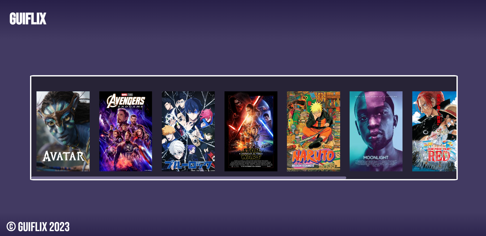
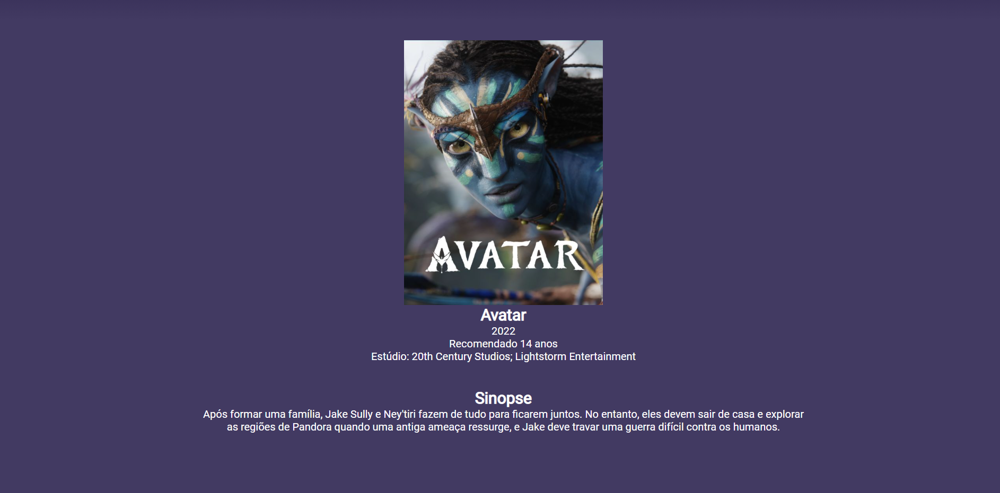

# GuiFlix Django

[pt-BR] 
Este é um projeto pessoal em Django no qual filmes séries livros podem ser cadastrados em poucos cliques facilitando o acesso e administração do sistema e do banco de dados. Ele foi contruido em Python juntamente com o framework Django, usando também HTML, CSS e SQLite.

[en-US]
This is a personal project in Django in which films, series and books can be registered in a few clicks, facilitating access and administration of the system and the database. It was built in Python along with the Django framework, also using HTML, CSS and SQLite.




# Video
| Thumb | Description |
| :-: | --- |
| [](https://youtu.be/Y982gZcIpsk) | [GuiFlix - DJango]()

## Technologies Used
- python 3.11.1

## Project Setup Instructions
1) git clone the repository 
```
$ git clone https://github.com/GuilhermeGodoi/GuiFlix-Django.git
```
2. create a virtual env
```
$ py -m venv env
```
3. activate env
```
$ env\scripts\activate
```
4. Install Dependancies
```
$ pip install -r requirements.txt
```
5. Make Migrations
```
$ py manage.py makemigrations
```
6. Migrate DB
```
$ py manage.py migrate
```
7. Run Application
```
$ py manage.py runserver
```